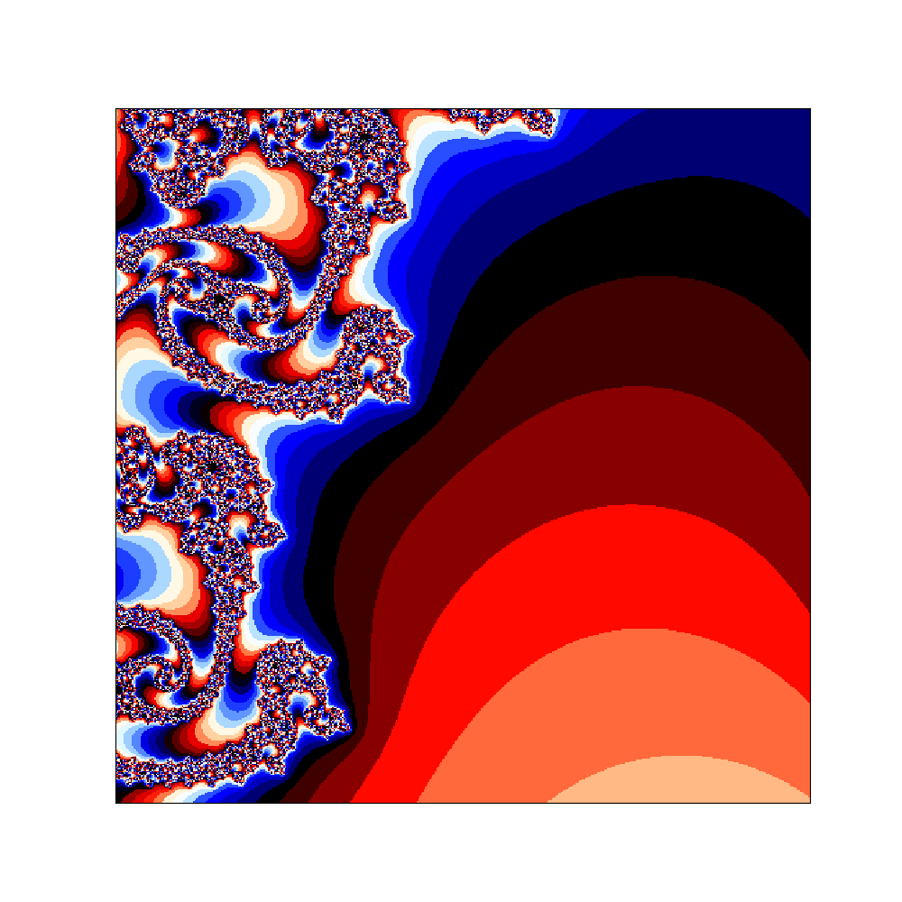
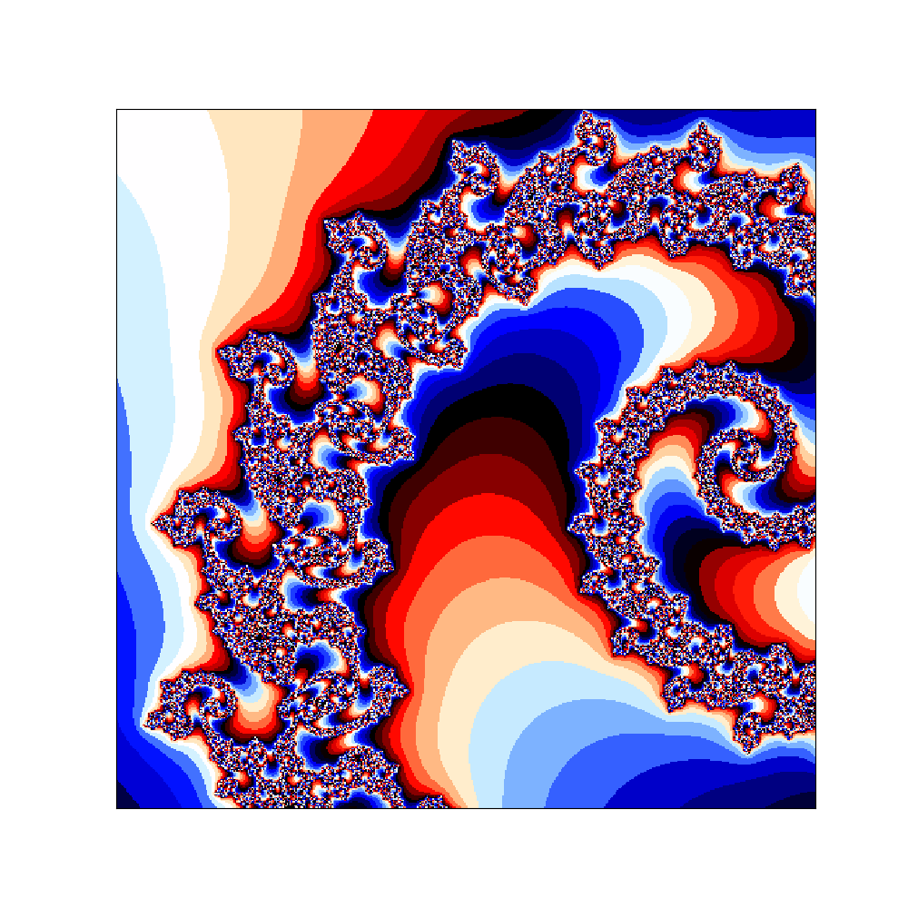
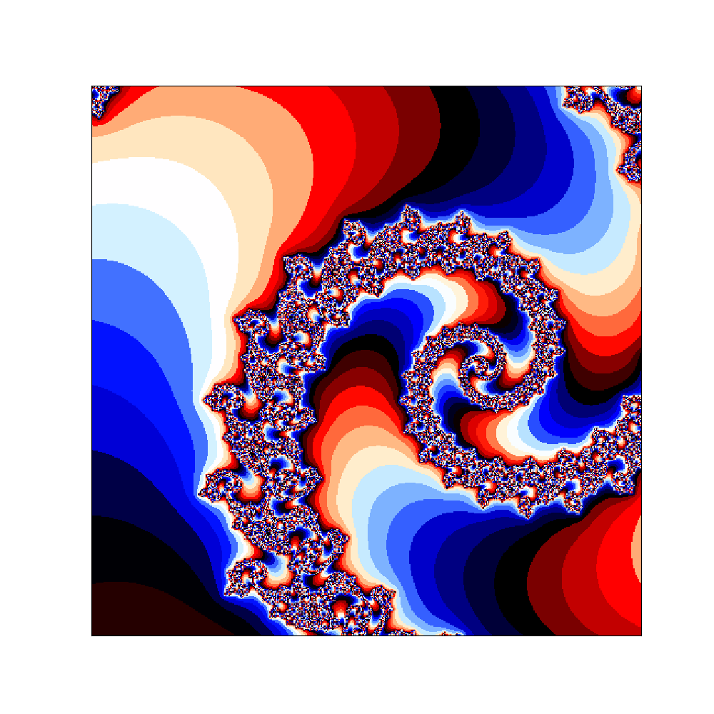
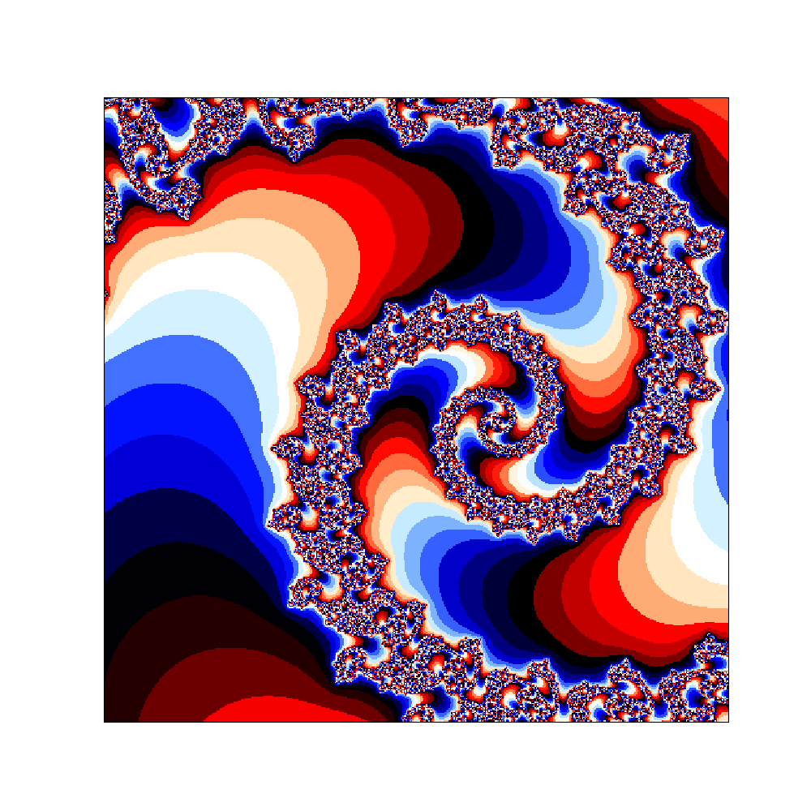

# Fractal Generator

A simple Python script to generate and visualize various fractals, including the Mandelbrot set and Julia sets. The script allows customization of parameters such as resolution, iteration limits, and zoom levels, enabling the creation of intricate fractal images.

## Examples

Below are some examples of fractals generated using this script:






## Features

- Generate Mandelbrot sets
- Generate Julia sets with custom parameters
- Customize resolution, iteration limits, and escape radius
- Zoom into specific regions of the fractal
- Save fractal images with custom color maps

## Usage

### Prerequisites

Ensure you have Python and the following libraries installed:
- `numpy`
- `matplotlib`
- `argparse`

You can install the required libraries using pip:

```sh
pip install numpy matplotlib argparse
```
### Running the Script
You can run the script with default parameters or customize the fractal generation using command-line arguments.

## Default Usage
To generate a Mandelbrot set with default parameters:

```sh
python fractal.py
```

## Custom Parameters
You can customize various parameters using command-line flags:

```sh
python fractal.py --real_min -2.0 --real_max 2.0 --imag_min -2.0 --imag_max 2.0 --hor_res 800 --ver_res 800 --max_iterations 500 --escape_radius 20 --power 3 --c_value 0.355+0.355j --zoom --zoom_center -0.7+0.3j --zoom_levels 5 --zoom_factor 10000
```
### Command-Line Arguments

- `--real_min`: Minimum real axis value (default: -2.5)
- `--real_max`: Maximum real axis value (default: 1.5)
- `--imag_min`: Minimum imaginary axis value (default: -2.0)
- `--imag_max`: Maximum imaginary axis value (default: 2.0)
- `--hor_res`: Horizontal resolution (default: 1000)
- `--ver_res`: Vertical resolution (default: 1000)
- `--max_iterations`: Maximum number of iterations (default: 300)
- `--escape_radius`: Escape radius (default: 10.0)
- `--power`: Power to raise the complex number (default: 2)
- `--c_value`: Constant value for Julia sets (default: 0+0j)
- `--zoom`: Enable zoom into a specific region (default: False)
- `--zoom_center`: Center point for zooming (default: -0.793191078177363+0.16093721735804j)
- `--zoom_levels`: Number of zoom levels (default: 10)
- `--zoom_factor`: Factor by which to zoom (default: 12000.0)
